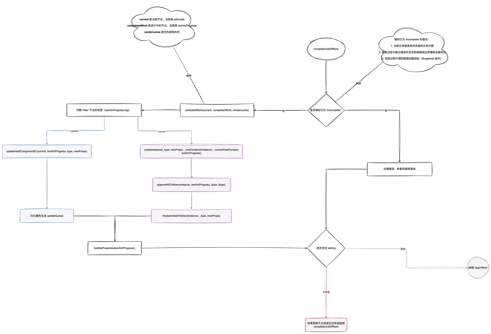

## 前言

React 在版本 15 与 16 有比较大的更改，那么这么大费周章的重构一定有存在了以前架构无法解决的痛点了。

现代的前端开发框架之间竞争非常激烈，React 想要稳固他的地位，那么提升 React 的性能是躲不过的事情。

## 一、16、17、18 版本更新了什么？

* 16.0.0 更改底层架构，采用 Fiber，提出异步渲染
* 16.1.0 推出了实验性的 [react-reconciler](https://github.com/facebook/react/blob/main/packages/react-reconciler/README.md) 包提供用户自定义 renderers
* ... 迭代更新
* 16.6.0 推出了实验性的 **Scheduler**
* 16.7.0 更新 Scheduler，正常迭代...
* 16.8.0 正式推出 Hook
* ... 迭代更新
* 16.13.0 实验性的 **Concurrent Mode**，`ReactDOM.createRoot()`
* 17.0.0 垫脚石版本，鼓励用户渐进式升级
  - 改变了 React 事件委托对象，以前是 document 现改为 React 容器根节点
  - 移除了事件池
  - 异步执行 `useEffect` 的 cleanup
* 18.0.0 主要是正式上线了 **Concurrent Mode**（并发模式）
  - 自动批处理—以前只有 React 的事件才会批处理，而被 `setTimeout` 等原生 js 语法包裹的事件无法批处理。
  - 过渡更新—推出 `startTransition` 告诉 React 哪些需要进行*过渡更新*，而不是*紧急更新*
  - Suspense 更加方便
  - 新的 Hook：`useId`、`useTransition`、`useDeferredValue`、`useSyncExternalStore`、`useInsertionEffect`

⚠️注意：React 默认不会开启 **Concurrent Mode**

## 二、为什么 React 要更新底层架构？

要想搞清楚这个问题，那么必须知道 React 是如何将*元素*渲染到页面中的（包括如何更新）。

就从 15 版本看：

* Reconciler—构建VDOM，准确来说 15 版本用的是 `stack-reconciler`
  - [实现stack-reconciler](https://zh-hans.legacy.reactjs.org/docs/implementation-notes.html)
* Rerender—渲染

以上两个便是 React 内部工作的核心，它们一个负责处理逻辑，一个负责渲染，各司其职，很美妙对不对。

但是，这是因为这样简单的结构导致 React 面对庞大数据量以及复杂交互时显得手忙脚乱（掉帧）。我们从一个简单的例子看起：

```ts
  // 想象一个简单的列表渲染以及更新
  // [1, 2, 3]
  // 渲染：
  //   reconciler 发现 1 并且知道了它应该渲染成什么样子，一切处理好后告诉 rerender 该渲染了，rerender 乖乖执行渲染
  //   reconciler 处理 2，rerender 渲染
  //   reconciler 处理 3，rerender 渲染
  // 一切看起来不错～
  // 这时候，用户下发了乘法指令，所有数字乘以 2，此时变为了 [2, 4, 6]
  // 更新：
  //   reconciler 发现原本为 1 的元素变为了 2，和之前不同，他兢兢业业处理好一切后告诉 rerender 该渲染了，rerender 乖乖执行渲染
  //   reconciler 处理 4，rerender 渲染
  //   reconciler 处理 6，rerender 渲染
```

上面的例子我们看起来也没什么问题，逻辑简洁清晰，但是如果用户的操作变多、数据量变大那么会出现什么情况呢？

> tips：浏览器是一帧一帧的渲染，即每一帧会处理 JS 逻辑、样式布局、样式绘制。

我们知道一般浏览器的刷新频率为 60Hz，即每（1000ms / 60Hz）16.6ms 浏览器刷新一次。

也就是说我们在这 16.6ms 中完成上述的一系列操作（JS 逻辑处理、样式布局、样式绘制），用户并不会有任何不适（除非你的眼睛和普通人不同）。

但是，由于数据量增大，我们的处理逻辑（JS 逻辑）占用了大量时间导致超过了 16.6ms，这时也就让用户感受到了不适。

虽然这时候的架构会导致掉帧，那我们可以进行优化呀，emmm，的确如此，我们做开发首先想到的是*如何优化原有逻辑*。

那么我们来尝试优化下：

* reconciler 长时间执行会导致掉帧，那我们就把他改为可以中断的执行，每一帧留给 JS 执行一定时间去执行，如果执行不完就放到下一帧去完成
* rerender 逻辑不太好，我们优化为一次性更新，由 reconciler 全部处理完毕后统一渲染，这样也不会导致由于被中断的执行导致渲染不一致

嗯，上面的优化很合理，但是实际上我们的 reconciler 采用的是递归的方式执行，我们都知道递归一旦运行就无法暂停（即便可以退出递归，但是无法保证下次继续执行）。


直到此，我们无计可施，于是 React 决定重构底层架构。

## 三、Fiber 架构

从上一节我们知道，原本的 `stack-reconciler` 无法解决 React 高性能优化的需求；所以，React 推出了 `fiber-reconciler`，并且他的主要目标就是：

* 能够中断任务且把任务切片化执行
* 能够调整优先级，重置并复用任务
* 能够在父元素与子元素之间交错处理，以支持 React 中的布局
* 能够在 `render()` 中返回多个元素（`return [<Comp1/>, <Comp2/>]`）
* 更好地支持错误边界

那我们知道了新架构的目标，对于新架构的变化就更加清晰了，接下来我就来梳理下 Fiber 架构有哪些内容。

先一起来看看 [Fiber](https://github.com/facebook/react/blob/main/packages/react-reconciler/src/ReactFiber.js) 的结构：

```js

/**
 * HTML nodeType values that represent the type of the node
 */
var ELEMENT_NODE = 1;
var TEXT_NODE = 3;
var COMMENT_NODE = 8;
var DOCUMENT_NODE = 9;
var DOCUMENT_TYPE_NODE = 10;
var DOCUMENT_FRAGMENT_NODE = 11;

// WorkTag
export const FunctionComponent = 0;
export const ClassComponent = 1;
export const IndeterminateComponent = 2; // Before we know whether it is function or class
export const HostRoot = 3; // Root of a host tree. Could be nested inside another node.
export const HostPortal = 4; // A subtree. Could be an entry point to a different renderer.
export const HostComponent = 5;
export const HostText = 6;
export const Fragment = 7;
export const Mode = 8;
export const ContextConsumer = 9;
export const ContextProvider = 10;
export const ForwardRef = 11;
export const Profiler = 12;
export const SuspenseComponent = 13;
export const MemoComponent = 14;
export const SimpleMemoComponent = 15;
export const LazyComponent = 16;
export const IncompleteClassComponent = 17;
export const DehydratedFragment = 18;
export const SuspenseListComponent = 19;
export const ScopeComponent = 21;
export const OffscreenComponent = 22;
export const LegacyHiddenComponent = 23;
export const CacheComponent = 24;
export const TracingMarkerComponent = 25;
export const HostHoistable = 26;
export const HostSingleton = 27;

function FiberNode(
  this: $FlowFixMe,
  tag: WorkTag,
  pendingProps: mixed,
  key: null | string,
  mode: TypeOfMode,
) {
  /** 作为静态数据结构的属性 */
  // Fiber对应组件的类型 Function/Class/Host...
  this.tag = tag;
  // key属性
  this.key = key;
  // 大部分情况同 type，某些情况不同，比如 FunctionComponent 使用 React.memo 包裹
  this.elementType = null;
  // 对于 FunctionComponent，指函数本身，对于 ClassComponent，指 class，对于 HostComponent，指 DOM 节点 tagName
  this.type = null;
  // Fiber对应的真实 DOM 节点
  this.stateNode = null;

  /** 用于连接其他 Fiber 节点形成 Fiber 树（链表结构）*/
  // 指向父级Fiber节点
  this.return = null;
  // 指向子Fiber节点
  this.child = null;
  // 指向右边第一个兄弟Fiber节点
  this.sibling = null;
  this.index = 0;

  this.ref = null;
  this.refCleanup = null;

  /** 作为动态的工作单元的属性 */
  // 保存本次更新造成的状态改变相关信息
  this.pendingProps = pendingProps;
  this.memoizedProps = null;
  this.updateQueue = null;
  this.memoizedState = null;
  this.dependencies = null;

  this.mode = mode;

  // 保存本次更新会造成的DOM操作
  this.flags = NoFlags;
  this.subtreeFlags = NoFlags;
  this.deletions = null;

  // 调度优先级相关
  this.lanes = NoLanes;
  this.childLanes = NoLanes;

  // 指向该 fiber 在另一次更新时对应的 fiber
  this.alternate = null;
}
```

从上面 Fiber 的结构分析来对应如何实现上面所述的*目标*：

* 能够中断任务且把任务切片化执行 => 用于连接其他 Fiber 节点形成 Fiber 树（链表结构）
* 能够调整优先级，重置并复用任务 => 调度优先级相关
* 能够在父元素与子元素之间交错处理，以支持 React 中的布局 => 得益于渲染方式的改变以及可中断的任务
* 能够在 `render()` 中返回多个元素（`return [<Comp1/>, <Comp2/>]`） => 数据结构的改变（`sibling` 字段）

### Fiber 节点之间的连接

```tsx
function App() {
  return (
    <div>
      <p>你好</p>
      <div>
        <p>senmu</p>
      </div>
    </div>
  )
}
```

它们解析为 Fiber 结构，如图：


### 完整的流程

初始化渲染：

* 走 `legacyRenderSubtreeIntoContainer` 方法，如果没有缓存的 root 容器，使用 `legacyCreateRootFromDOMContainer` 方法创建 root 容器
  - 会设置优先级为最高
  - 初始化更新队列 `updateQueue`

* 走 `updateContainer` 方法，加入更新队列，设置好优先级
  - `payload` 是 `element`

  ```js
  flushSync(function () {
    updateContainer(initialChildren, _root, parentComponent, callback);
  });
  ```

* 走 `scheduleUpdateOnFiber` 将更新回调（`performSyncWorkOnRoot` 方法）加入调度队列
  - `ensureRootIsScheduled` 该方法是重点，保证 root 容器可以被调度

* 走 `flushSyncCallbacks` 执行同步调度队列（优先级最高的）

* 走 `performSyncWorkOnRoot`
  - `var exitStatus = renderRootSync(root, lanes);` 需要拿到退出的状态

* 走 `renderRootSync` 同步进行 `render` 阶段，拿到退出状态
  - 期间会走 `prepareFreshStack` 创建工作进程（`workInProgress`）
  - 完成更新队列，并重新赋值下次更新队列

* 走 `workLoopSync`，该工作是 `render` 阶段的重点，会遍历一边 Fiber 链表
  - 顺着上面构建的 `workInProgress` 来进行遍历

* 走 `performUnitOfWork` 方法
  - `beginWork` 深度优先，完成第一个最深节点后进行 `completeUnitOfWork` 工作
  - `completeUnitOfWork` 完成工作，遇到 sibling 需要继续返回 `beginWork` 工作

* `commit` 阶段


#### `beginWork` 做了什么？

调用 `beginWork` 时需要传入 `current`、`workInProgress`、`renderLanes` 这三个参数

* `current` 当前的 Fiber 节点，其实就是 `workInProgress.alternate` 内容，也就是说在 `update` 时会复用的节点
* `workInProgress` 很熟悉了，这个就是目前正在进行中的 Fiber
* `renderLanes` 优先级相关

我们就初次渲染来看，`current` 不为空，那么就进入到了 `update` 逻辑，因为是初次渲染，也没有 `props` 与 `context` 的变化，一顿判断后来到关键逻辑，判断 Fiber 的类型，
根节点的类型为 `HostRoot` 也就是 3，就来到了 `updateHostRoot` 逻辑。

**`updateHostRoot`** 逻辑：

  * `pushHostRootContext(workInProgress)` 建立维护 Context 与根容器（Container）的栈结构关系（包括 Protals 节点）
    - Context 通过维护栈来管理 Fiber 复杂的父子关系值

  * `reconcileChildren` 内部同样有 `mount` 与 `update` 逻辑，但是它们内部方法一样
    - 协调算法，判断该节点是否可以复用或者要被删除等（diff）
    - 标记插入、移动、删除、更新，便于后续渲染节点的操作

  * 构建好了下一个节点返回执行栈

总结下 `beginWork` 的逻辑：

* 判断是否首次渲染
* 更新
  - 判断是否可以复用
  - 可以复用的话继续下面的逻辑，不可以复用的话跳出当前判断逻辑继续执行
  - 可以就判断子节点是否需要更新
  - 需要的话就返回该节点
  - 不需要的话就跳过
* 首次渲染
  - 需要构建节点
* 判断节点的类型（`workInProgress.tag`）
  - 根据节点类型不同会执行对应逻辑，上面的 `updateHostRoot` 就是其中一个
  - `reconcileChildren` 对应 `mountChildFibers(workInProgress, null, nextChildren, renderLanes);` 和 `reconcileChildFibers(workInProgress, current.child, nextChildren, renderLanes);` 渲染或者更新，参考上面的逻辑
* 构建好下一个 `workInProgress`

流程图如下：


#### `completeUnitOfWork` 做了什么？

* 先判断是否有更紧急任务（`workInProgress.flag` 为 `Incomplete`），如果没有进入当前节点的“`completeWork`（完成工作）”，如果有则要跳过
* `completeWork` 阶段
  - 同样判断节点的类型（`workInProgress.tag`）
  - 判断是 update 还是 mount，进入不同逻辑
  - 如果是 mount 的话，则会创建实例，并且将节点插入构成 Fiber 树，等待 `commit` 阶段渲染为真实 DOM
  ```js
    var _rootContainerInstance = getRootHostContainer();
    var instance = createInstance(_type, newProps, _rootContainerInstance, _currentHostContext, workInProgress);
    appendAllChildren(instance, workInProgress, false, false);
    workInProgress.stateNode = instance;
  ```
  - 如果是 update 的话，则会生成 `updatePayload`，并且赋值 `workInProgress.updateQueue = updatePayload`（这部分是处理`onClick`、`style prop`、`DANGEROUSLY_SET_INNER_HTML prop`、`children prop`）
  - 最后 `bubbleProperties(workInProgress)`
* 判断当前节点是否存在 sibling 节点，如果有的话要继续进入 sibling 节点的 `beginWork` 工作

流程图如下：



#### `commit` 阶段做了什么？

* `rootDoesHavePassiveEffects` 存在就执行 `flushPassiveEffects()`
* `commitBeforeMutationEffects()` before mutation 阶段
* `commitMutationEffects()` mutation 阶段，主要是渲染真实 DOM
* `commitLayoutEffects()` layout 阶段，执行 layout Effect
* `onCommitRoot()` ？？

疑问：

1. 如何构建 `workInProgress` ===> 调用 `createWorkInProgress()` 方法
  - `workInProgress.alternate = current;` 缓存该节点（第一次渲染时会缓存根节点）
2. 谁去调用 `workLoopSync`，为什么会执行两次 ===> 错❌，并没有调用两次；只是内部执行 `var children = Component(props, secondArg);`。
3. `alternate` 字段什么含义？相当于节点的缓存 ✅
4. `beginWork()` 做了什么？✅
5. 初次渲染时进入 `beginWork` 会进入 `update` 逻辑，这是因为在创建 `workInProgress` 时缓存了根节点
6. `reconcileChildren()` 做了什么？（协调算法，初次渲染直接 mount 全部，更新时需要研究 diff 算法）
7. `rootDoesHavePassiveEffects` 这个变量什么时候赋值的？执行 Effect 之前会判断是否有正在进行的 Effect
8. `onCommitRoot()` 做了什么？


收获点：

1. Google Closure Compiler - `/** @noinline */` 对应可以让该函数不被内联结构
2. 

```js
loop1: do {
  switch(name) {
    case 'senmu':
      // do something
      break loop1; // 可以直接退出 do...while 循环
    case 'SenMu':
      // do something
      break; // 只能退出 switch 语句
  }
  break; // 退出 do...while 循环
} while(true)
```

3. React18 初始化渲染时不会开启切片/并发模式（不论是否用 createRoot 方法渲染），更新时需要用到某些 API 才能开启并发模式，例如：`startTransition`

```tsx
import { startTransition } from 'react';

function App() {
  const [len, setLen] = useState(0);

  // 模拟加载数据后更新列表
  function loadData() {
    startTransition(() => {
      setLen(3000);
    });
  }

  return (
    <div>
      <button onClick={loadData}>Load Data</button>
      <ul>
        {Array(len)
          .fill(0)
          .map((_, i) => (
            <li key={i}>{i}</li>
          ))}
      </ul>
    </div>
  );
}
```